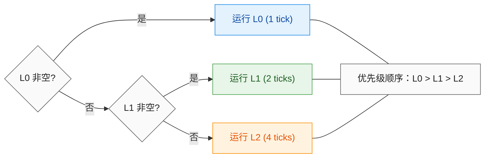
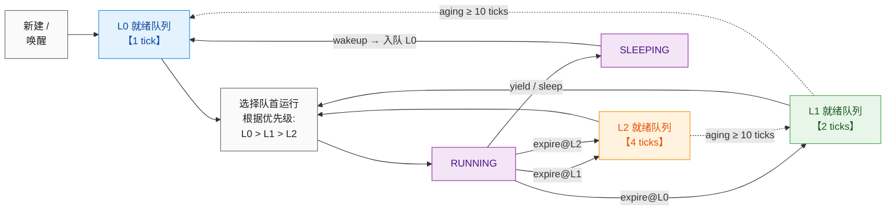
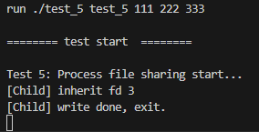
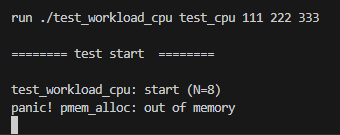

# LAB-10: 进程调度 之 多级反馈调度算法（MLFQ） 与 性能分析

在 Lab-9 实现完整系统功能的基础上，Lab-10 开始对内核性能进行针对性改进。我选择从**进程调度**入手进行优化，将原先的简单 **时间片轮转（RR）** 升级为更智能的 **多级反馈（MLFQ）** 调度算法，并引入了 **调度统计（Schedstat）** 机制，通过实测数据来定量分析优化效果。


---

## 代码组织结构


```
OS2025-SEAOS 
├── LICENSE        开源协议
├── .vscode        配置了可视化调试环境
├── registers.xml  配置了可视化调试环境
├── .gdbinit.tmp-riscv xv6自带的调试配置
├── common.mk      Makefile中一些工具链的定义
├── Makefile       编译运行整个项目 (CHANGE)
├── picture        README使用的图片目录 (CHANGE)
├── README.md      实验报告 (CHANGE)
└── src            源码
    ├── kernel     内核源码
    │   ├── arch   RISC-V相关
    │   │   ├── method.h
    │   │   ├── mod.h
    │   │   └── type.h
    │   ├── boot   机器启动
    │   │   ├── entry.S
    │   │   └── start.c
    │   ├── lock   锁机制
    │   │   ├── spinlock.c
    │   │   ├── sleeplock.c
    │   │   ├── method.h
    │   │   ├── mod.h
    │   │   └── type.h
    │   ├── lib    常用库
    │   │   ├── cpu.c
    │   │   ├── console.c 
    │   │   ├── print.c 
    │   │   ├── uart.c 
    │   │   ├── utils.c
    │   │   ├── method.h 
    │   │   ├── mod.h
    │   │   └── type.h 
    │   ├── mem    内存模块
    │   │   ├── pmem.c 
    │   │   ├── kvm.c
    │   │   ├── uvm.c
    │   │   ├── mmap.c
    │   │   ├── method.h 
    │   │   ├── mod.h
    │   │   └── type.h
    │   ├── trap   陷阱模块
    │   │   ├── plic.c
    │   │   ├── timer.c
    │   │   ├── trap_kernel.c
    │   │   ├── trap_user.c
    │   │   ├── trap.S
    │   │   ├── trampoline.S
    │   │   ├── method.h
    │   │   ├── mod.h
    │   │   └── type.h
    │   ├── proc   进程模块
    │   │   ├── mlfq.c (本实验完成, MLFQ调度器的核心实现)
    │   │   ├── proc.c (本实验完成, 集成MLFQ调度逻辑及调度统计)
    │   │   ├── exec.c (本实验修复)
    │   │   ├── swtch.S
    │   │   ├── method.h (CHANGE, 增加MLFQ相关定义)
    │   │   ├── mod.h
    │   │   └── type.h (CHANGE, 增加调度统计相关字段)
    │   ├── syscall 系统调用模块
    │   │   ├── syscall.c (本实验补充, 新的系统调用 sys_schedstat)
    │   │   ├── sysfunc.c (本实验补充, 新的系统调用 sys_schedstat)
    │   │   ├── method.h (CHANGE)
    │   │   ├── mod.h
    │   │   └── type.h (CHANGE)
    │   ├── fs     文件系统模块
    │   │   ├── bitmap.c
    │   │   ├── buffer.c
    │   │   ├── inode.c
    │   │   ├── device.c
    │   │   ├── dentry.c 
    │   │   ├── fs.c 
    │   │   ├── virtio.c
    │   │   ├── method.h
    │   │   ├── mod.h
    │   │   └── type.h 
    │   └── main.c
    ├── mkfs       磁盘映像初始化
    │   ├── mkfs.c (本实验补充，支持间接块以处理大文件)
    │   └── mkfs.h 
    ├── loader     存放链接脚本
    │   ├── kernel.ld 
    │   └── user.ld 
    └── user       用户程序
        ├── initcode.c 
        ├── syscall.c (CHANGE, 新的系统调用 sys_schedstat)
        ├── help.c (CHANGE)
        ├── test_1.c 
        ├── test_2.c 
        ├── test_3.c 
        ├── test_4.c 
        ├── test_5.c
        ├── test_workload_cpu.c (NEW, CPU密集型压力测试)
        ├── test_workload_io.c  (NEW, IO密集型压力测试)
        ├── test_workload_mix.c (NEW, 混合负载压力测试)
        ├── test_schedstat.c (NEW, 调度统计工具测试)
        ├── test_mlfq_aging.c (NEW, MLFQ老化机制测试)
        ├── test_mlfq_preempt.c (NEW, MLFQ抢占机制测试)
        ├── help.h (CHANGE, 库函数和重要定义)
        ├── sys.h
        ├── syscall_arch.h
        └── syscall_num.h (CHANGE, 新的系统调用 sys_schedstat)
```


本实验主要增加了以下功能：

- **多级反馈调度算法**：实现了 3 个优先级的反馈队列 (MLFQ)，支持时间片轮转、优先级动态调整（老化/惩罚）和抢占机制。
- **调度统计 (Schedstat)**：在进程控制块 (PCB) 中增加了 `run_time`, `wait_time`, `sleep_time` 等统计字段，并提供了 `sys_schedstat` 系统调用供用户态读取。
- **性能分析套件**：编写了 CPU、IO 和混合负载的测试程序，用于定量对比不同调度算法之间的性能差异。

---

## 具体实现

### 1. 多级反馈调度算法

在 `mlfq.c` 中，我实现了一个包含 **3 个优先级队列** 的 MLFQ 调度器，旨在平衡系统的响应时间和吞吐量。具体参数如下：

- **优先级层级**：
  - `Level 0` (最高)：时间片 **1 tick**。新进程默认进入此队列，适合**交互式任务**。
  - `Level 1` (中等)：时间片 **2 ticks**。
  - `Level 2` (最低)：时间片 **4 ticks**。适合 **CPU 密集型长任务**。
- **老化机制**：
  - `Aging Threshold`：**10 ticks**。当一个进程在低优先级队列中等待超过此阈值时，其优先级将被提升,以**防止低优先级任务饥饿**。
  
为了清晰理解多级进程在不同队列间的流转逻辑，我将调度过程拆成两部分分析：**(1) 调度器如何选择队列**、**(2) 单个进程如何在队列间迁移**。

**(1) 调度器选择策略**

调度器永远**优先选择最高优先级的非空队列**进行调度。具体逻辑如下图所示：



**(2) 进程迁移规则**

进程在不同优先级队列之间的流动遵循“**动态调整**”原则：**新进程或刚唤醒的交互式进程**会进入**高优先级**队列以获得快速响应；而**耗时较长的 CPU 密集型进程**则会逐渐“沉降”到**低优先级**队列，避免阻塞系统。

具体的流转路径如下图所示：



#### 1.1 `mlfq.c` 核心调度逻辑

在 `mlfq.c` 中，我封装了多级反馈队列的核心数据结构与操作接口，主要实现了以下功能：

- **多级队列管理**：
  - 定义了 `MLFQ_LEVELS = 3` 个优先级的就绪队列 (`mlfq_runq_t`)。
  - 每个队列维护一个环形缓冲区 (`buf[N_PROC]`)，支持 FIFO 的入队 (`runq_push`) 和出队 (`runq_pop`) 操作。
  - 引入全局自旋锁 `mlfq_lk`，保护所有队列的并发访问，确保入队/出队操作的原子性。

- **进程入队策略 (`mlfq_enqueue_locked_plocked`)**：
  - **新进程/唤醒进程**：默认进入**最高优先级**队列 (`Level 0`)，并重置时间片，以保证交互响应。
  - **时间片耗尽 (`MLFQ_YIELD_EXPIRE`)**：若当前时间片用完，进程将被**降级**到下一级队列（如 L0 -> L1），并重置时间片。
  - **主动让出/抢占 (`MLFQ_YIELD_VOLUNTARY/HIGHER`)**：若进程因等待 I/O 或被高优先级抢占而放弃 CPU，则**保持当前优先级不变**，且不重置剩余时间片（在 `mlfq_on_yield` 中实现）。

- **调度选择器 (`mlfq_pick_next`)**：
  - 实现了**严格优先级调度**：总是从**最高优先级的非空队列**中取出进程。
  - 只有当 `Level 0` 为空时，才检查 `Level 1`，以此类推。
  - 取出进程后，会自动为其分配对应层级的时间片配额 (`mlfq_quantum`)。

- **老化机制 (`mlfq_age_tick`)**：
  - 在每次时钟中断时被调用，遍历所有非最高优先级队列。
  - 增加进程的等待时间计数 (`mlfq_wait_ticks`)。
  - 若**等待时间超过阈值** (`MLFQ_AGING_THRESHOLD = 10`)，则将进程**提升一级**（如 L2 -> L1），防止饥饿。


#### 1.2 `proc.c` 集成 MLFQ 调度逻辑

`proc.c` 将 MLFQ 调度器集成到内核的进程管理流程中，我主要修改了以下几点：

- **进程状态与生命周期管理**：
  - **创建 (`proc_make_first`, `proc_fork`)**：新进程创建后，调用 `mlfq_on_new(p)` 将其加入 MLFQ 的 Level 0 队列。
  - **唤醒 (`proc_wakeup`, `proc_try_wakeup`)**：当进程从 `SLEEPING` 变为 `RUNNABLE` 时，调用 `mlfq_on_wakeup(p)` 将其重新加入 Level 0 队列，确保 **I/O 密集型任务能立即获得 CPU**。
  - **让出 (`proc_yield`)**：在进程主动放弃 CPU 时，根据 `p->mlfq_yield_reason`（时间片耗尽、主动让出或被抢占）调用 `mlfq_on_yield`，决定其下一轮的优先级和队列位置。

- **调度器主循环 (`proc_scheduler`)**：
  - 废弃了原有的遍历进程数组寻找 `RUNNABLE` 的逻辑。
  - 改为调用 `mlfq_pick_next()` 直接获取下一个要运行的进程，大幅降低了调度开销，从 O(N) 降低到 O(1)。

- **时钟中断处理 (`proc_on_tick`)**：
  - 在每次时钟中断时，递减当前进程的剩余时间片 (`p->mlfq_ticks_left`)。
  - 若时间片耗尽，标记原因 `MLFQ_YIELD_EXPIRE` 并返回 1 触发调度。
  - 调用 `mlfq_has_higher` 检查是否有更高优先级的进程就绪，若有则标记 `MLFQ_YIELD_HIGHER` 并触发**抢占**。
  - 调用 `mlfq_age_tick` 执行**老化**逻辑。


### 2. 调度统计与 Mkfs 升级

- **调度统计 （Schedstat）**：
  为了**量化分析**不同调度策略的效果，我在 `proc_t` 中维护了 `run_time` (运行时间), `wait_sum` (总等待时间), `wait_max` (最大等待时间) 等计数器，具体见下表：

  | 字段名 | 简称  | 含义 | 统计时机 |
  | :--- | :--- | :--- | :--- |
  | `pid` | `pid` | 进程 ID | 进程创建时 |
  | `state` | `state` | 进程状态 | 实时 |
  | `mlfq_level` | `lvl` | 当前 MLFQ 优先级 | 实时 |
  | `cpu_ticks` | `cpu` | 累计 CPU 运行时间 (ticks) | 时钟中断时递增 |
  | `wait_sum` | `wait_sum` | 累计就绪等待时间 (ticks) | 进程从 READY 变 RUNNING 时累加 |
  | `wait_max` | `wait_max` | 单次最大等待时间 (ticks) | 进程从 READY 变 RUNNING 时更新 |
  | `run_count` | `run` | 获得 CPU 的次数 | 调度器选中进程时递增 |
  | `ready_count` | `ready` | 进入就绪队列的次数 | 进程入队时递增 |
  | `ctx_switches` | `ctx` | 上下文切换次数 | `swtch` 调用时递增 |
  | `preempt_expire` | `preExp` | 时间片耗尽被抢占次数 | `yield` 原因 = EXPIRE 时递增 |
  | `preempt_higher` | `preHigh` | 被高优先级抢占次数 | `yield` 原因 = HIGHER 时递增 |
  | `yield_voluntary` | `yield` | 主动让出 CPU 次数 | `yield` 原因 = VOLUNTARY 时递增 |
  | `sleep_count` | `sleep` | 主动睡眠次数 | `sleep` 调用时递增 |
  | `first_run_tick` | `first` | 首次运行时刻 | 第一次被调度时记录 |

- **Mkfs 升级**：
  - 由于测试文件不断增加，生成的日志文件越来越大，且原有的文件系统不支持大文件写入，因此发生了报错： `inode_append: data len out of space!`。
  - 我修改了 `mkfs.c`，实现了**一级间接块**和**二级间接块**的索引逻辑，大幅扩充了最大文件大小。

---

## 测试与修复

### test1-4: 基本功能测试

测试代码见 `src/user/test_1.c` 至 `src/user/test_4.c`。这些测试验证了用户态的基础设施是否完备，包括参数传递、文件读写、路径解析和设备文件操作。

**测试过程中遇到的问题与修复**：

在运行这些基础测试时，我遇到了一个严重的内核崩溃问题：

```
trap_id = 12, sepc = 0x00000000801930a8, stval = 0x00000000801930a8
panic! trap_kernel_handler
```

- **原因分析**：经过调试，发现是调度器引入的并发 Bug。原有的 `proc_yield()` 在调用 `swtch()` 切换上下文之前，就提前释放了进程锁 `p->lk`。这导致在多核环境下，另一个 CPU 的调度器可能在当前 CPU 还没真正切走时，就选中并运行了同一个进程，导致**同一进程在两核并行运行**，破坏了内核栈。

- **修复方案**：我引入了全局调度锁 `mlfq_lk`，并严格统一锁的获取顺序：**先获取 `mlfq_lk`，再获取 `p->lk`**。这样确保了调度操作的原子性，彻底避免了交叉持锁和并发调度同一进程的问题。

测试结果见 `test-1.png`[](pictures/test-1.png) 至 `test-4.png`(pictures/test-4.png)，均通过。

### test-5: 多进程文件共享

测试代码见 `src/user/test_5.c`。该测试验证了fork 后父子进程对文件资源的共享机制是否正确。

**测试过程中遇到的问题与修复**：

测试时我发现：子进程退出后，父进程一直卡在 `SLEEPING` 状态，如下图所示：



- **原因分析**：子进程 `exit` 时会唤醒父进程，将父进程状态改为 `RUNNABLE`。但在 MLFQ 调度器下，仅仅改变状态是不够的，必须**显式地将进程重新加入就绪队列**。原有的 `proc_try_wakeup` 漏掉了这一步，导致父进程虽然状态是 `RUNNABLE`，但不在任何队列中，永远得不到调度。

- **修复方案**：我在 `proc_try_wakeup` 中调用了 `mlfq_on_wakeup(p)`，确保被唤醒的进程能正确入队。
  
```c
// 唤醒等待“自己”的父进程
bool woke = false;
spinlock_acquire(&parent->lk);
if (parent->state == SLEEPING && parent->sleep_space == parent) {
    parent->state = RUNNABLE;
    parent->sleep_space = NULL;
    woke = true;
}
spinlock_release(&parent->lk);

// 【修复】 父进程变为 RUNNABLE 后，需要重新进入就绪队列
if (woke)
    mlfq_on_wakeup(parent);
```

测试结果见 `test-5.png`[](pictures/test-5.png)，可以看到父进程成功被唤醒并检测到了子进程写入的数据偏移，且文件内容正确，测试通过。

### test_schedstat: 调度统计测试

测试代码见 `src/user/test_schedstat.c`。该新增的测试验证了**调度统计功能的正确性**，确保各项计数器能准确反映进程的运行行为。

**测试逻辑**：
创建 2 个 CPU 密集型子进程和 2 个 IO 密集型子进程，运行一段时间后调用 `sys_schedstat` 获取所有进程的统计信息。

**测试过程中遇到的问题与修复**：

在运行调度统计测试时，系统频繁创建和销毁进程。我发现随着测试进行，可用物理内存持续减少，最终导致 `pmem_alloc` 失败：



- **原因分析**：经过检查 `exec.c` 的逻辑，发现 `uvm_destroy_pgtbl` 会递归释放页表映射的所有物理页（包括映射在其中的 `trapframe`），但在错误处理分支和成功分支中，我又手动调用了 `pmem_free((uint64)new_tf)` 或 `pmem_free((uint64)p->tf)`。这导致了**双重释放 (Double Free)** ，破坏了物理内存分配器的链表结构。

- **修复方案**：在 `src/kernel/proc/exec.c` 中，我移除了多余的 `pmem_free` 调用。因为 `trapframe` 已经被映射到了页表中，调用 `uvm_destroy_pgtbl` 时会自动释放对应的物理页，无需手动释放。
     ```c
     // 【修复】仅调用销毁页表函数，由它统一回收物理内存，删除多余的 pmem_free 调用
     // pmem_free((uint64)new_tf, false); 
     uvm_destroy_pgtbl(new_pgtbl);
     ```
  
测试结果见 [`test_schedstat.png`](pictures/test_schedstat.png)，成功打印出所有子进程的 `pid`, `state`, `lvl` (优先级), `run` (运行次数) 等信息，验证了调度统计功能的正确性。

### test_mlfq_aging: MLFQ 老化测试

测试试代码见 `src/user/test_mlfq_aging.c`。该测试验证了 MLFQ 的**老化机制**是否有效，确保低优先级进程不会因长时间等待而饥饿。

**测试逻辑**：
1. 创建一个低优先级的 CPU 霸占进程 (`hog`)。
2. 创建大量高优先级的短任务 (`bursty`)，试图“淹没”调度器。
3. 检查 `hog` 进程是否依然能获得 CPU 时间 (`run_count` > 0 且 `cpu_ticks` > 0)。
   
测试结果见 [test_mlfq_aging.png](pictures/test_mlfq_aging.png)，可以看到即使在大量高优先级任务的压力下，`hog` 进程依然获得了 CPU 时间，验证了老化机制的有效性。

### test_mlfq_preempt: MLFQ 抢占测试

测试代码见 `src/user/test_mlfq_preempt.c`。该测试验证了 MLFQ 的**抢占机制**是否生效，确保高优先级进程能及时抢占低优先级进程的 CPU。

**测试逻辑**：
1. 创建一个死循环的 CPU 霸占进程 (`hog`)，它会迅速降级到最低优先级。
2. 创建一个反复睡眠/唤醒的 IO 进程 (`waker`)，它应保持在高优先级。
3. 验证 `hog` 进程的 `preempt_higher` 计数器是否增加。
   
测试结果见 [test_mlfq_preempt.png](pictures/test_mlfq_preempt.png)，显示 `PASS: observed higher-prio preempt`，证明了当高优先级任务就绪时，MLFQ 调度器能够正确触发抢占机制，打断低优先级任务的运行。

---

## 性能对比分析 (RR vs MLFQ)

为了验证 MLFQ 算法相对于传统 RR 算法的优势，我设计了三组对照实验，分别模拟 **CPU 密集型**、**IO 密集型** 和 **混合负载** 场景。

### 1. CPU 密集型负载 (CPU-Bound)

测试代码见 `src/user/test_workload_cpu.c`。该测试旨在评估调度器在**高 CPU 需求**下的表现。

**测试逻辑**：并发运行 8 个纯计算进程（死循环），无 IO 操作。

**测试结果对比**：

RR 和 MLFQ 的测试结果分别见 [RR_test_cpu.png](pictures/RR_test_cpu.png) 和 [MLFQ_test_cpu.png](pictures/MLFQ_test_cpu.png)，总结如下表：

| 关注指标 | RR (Lab-9) | MLFQ (Lab-10) | 现象与分析 |
| :--- | :--- | :--- | :--- |
| **进程优先级** | N/A | **Level 1 / 2** | MLFQ **成功识别出长任务**。结果显示进程迅速耗尽 L0 时间片，最终稳定在 L1 或 L2。 |
| **Wait Sum** | ~7-8 ticks | ~3-7 ticks | 两者等待时间处于同一数量级。 |
| **调度行为** | 轮转调度 | 在低优先级队列轮转 | **MLFQ 退化为 RR**。 |

**结论**：在**纯计算**场景下，**MLFQ 的表现与 RR 基本一致**。所有进程迅速“沉降”到底层队列，这符合预期：对于**批处理任务**，**公平性比响应时间更重要**，MLFQ 在底层队列采用轮转机制保证了这一点。


### 2. IO 密集型负载 (IO-Bound)

测试代码见 `src/user/test_workload_io.c`。该测试旨在评估调度器在高 IO 需求下的表现。

**测试逻辑**：并发运行 8 个 IO 进程，反复执行 `sleep(1)` 模拟频繁交互。

**测试结果对比**：

RR 和 MLFQ 的测试结果分别见 [RR_test_io.png](pictures/RR_test_io.png) 和 [MLFQ_test_io.png](pictures/MLFQ_test_io.png)，总结如下表：

| 关注指标 | RR (Lab-9) | MLFQ (Lab-10) | 现象与分析 |
| :--- | :--- | :--- | :--- |
| **进程优先级** | N/A | **Level 0 (最高)** | MLFQ **识别出短任务**。结果显示所有 IO 进程始终保持在 `lvl 0`。 |
| **Wait Sum** | **~8-9 ticks** | **0 ticks** | **MLFQ 实现了零等待！** |
| **Wait Max** | ~3 ticks | **0 ticks** | 彻底消除了长尾延迟。 |

**结论**：这是 **MLFQ 优势最明显**的场景。
- **RR**：IO 进程唤醒后，必须排在就绪队列末尾。结果显示 `wait_sum` 接近进程总数，说明它们每次醒来都要排队。
- **MLFQ**：IO 进程因频繁放弃 CPU，始终保持在 Level 0。一旦唤醒，**立即抢占**低优先级任务或直接运行，实现了**极致的响应速度**。

### 3. 混合负载 (Mixed Workload) 

测试代码见 `src/user/test_workload_mix.c`。该测试旨在评估调度器在**混合 CPU 和 IO 需求**下的表现，是核心场景！

**测试逻辑**：6 个 CPU 密集型进程 (PID 3-8) + 6 个 IO 密集型进程 (PID 9-14) + 1 个突发进程 (PID 15)。

**测试结果对比**：

RR 和 MLFQ 的测试结果分别见 [RR_test_mix1.png](pictures/RR_test_mix1.png) ~ [RR_test_mix2.png](pictures/RR_test_mix2.png) 和 [MLFQ_test_mix.png](pictures/MLFQ_test_mix.png) ~ [MLFQ_test_mix2.png](pictures/MLFQ_test_mix2.png)，总结如下表：

| 进程类型 | 关注指标 | RR (Lab-9) | MLFQ (Lab-10) | 现象与分析 |
| :--- | :--- | :--- | :--- | :--- |
| **IO 进程** | `wait_sum` | **2 ticks** | **1 tick** | RR 中 IO 任务每次唤醒需等待约 2 个时间片；MLFQ 将其降低了 **50%**，几乎即时响应。 |
| **IO 进程** | `lvl` | N/A | **Level 0** | 结果显示所有 IO 进程始终稳居 **Level 0**，未受 CPU 任务干扰。 |
| **CPU 进程** | `lvl` | N/A | **Level 1** | 结果 `[mid1]` 显示 PID 5 和 6 被正确识别并**降级到 Level 1**，证明了惩罚机制生效。 |
| **CPU 进程** | `cpu` | ~1-2 ticks | ~2 ticks | 即使被降级，CPU 任务依然利用了 IO 任务 Sleep 时的空隙执行，**未发生饥饿**。 |

**结论**：在混合负载场景下，MLFQ 成功实现了“**各取所需**”的资源分配目标，明显优于 RR：

- **分类准确**：结果清晰地展示了 lvl 的分层 —— **IO 任务** (PID 9-14) 保持在 L0，而**计算任务** (如 PID 5, 6) 开始向 L1 沉降。表明 MLFQ 能够**准确区分不同类型的任务**。

- **响应提升**：O 任务的平均等待时间从 RR 的 2 ticks 降低到 MLFQ 的 1 tick，**显著提升了交互性能**；同时 CPU 任务也未被饿死，证明 MLFQ 在保证响应性的同时，也**维护了系统的整体吞吐量**。
  

综上所述，通过三组对比实验，可以清晰地看到 **MLFQ 相较于 RR 的显著提升**：

1.  **响应性的质变**：
    在 **IO 密集型**场景下，MLFQ 利用高优先级队列和抢占机制，将任务等待时间从 RR 的 ~9 ticks 消除至 **0 ticks**。这意味着对于键盘输入等交互式操作，MLFQ 能提供**即时响应**，彻底解决了 RR 算法中交互任务需排队等待长作业的问题。

2.  **智能的任务分类 (Smart Classification)**：
    在**混合负载**下，MLFQ 展现了强大的**自适应能力**。它无需预先知道进程类型，就能根据运行时的行为（是否用完时间片）自动将 IO 任务保留在 Level 0，将 CPU 任务降级至 Level 1/2。相比之下，RR 对所有任务一视同仁，无法对关键任务进行倾斜。

3.  **兼顾公平与效率**：
    对于 CPU 密集型任务，MLFQ 虽然将其降级，但通过底层队列更长的时间片（4 ticks）减少了上下文切换开销，保证了系统吞吐量**不低于 RR**。同时，配合**老化机制**，MLFQ 成功**避免了低优先级任务的饥饿**，在追求高性能的同时守住了公平的底线。

---

## 总结

本实验完成了从基础功能构建到内核性能优化的关键转变，通过实现 MLFQ 调度器和配套的统计工具，我对操作系统资源管理有了更深层次的理解：

-  **调度算法的本质权衡**：
   -  实验数据表明，**没有一种调度算法在所有指标上都是最优的**。
   -  RR 算法实现简单且公平，但在混合负载下会导致交互式任务的高延迟；
   -  MLFQ 通过引入复杂性（多级队列、动态优先级、老化机制），在响应时间和吞吐量之间找到了更好的平衡点。这验证了系统设计中“**用复杂性换取性能**”的常见工程权衡。

-  **机制与策略的分离**：
    - 在代码实现过程中，我深刻体会到了**机制与策略分离**的重要性。`mlfq.c` 提供了队列操作、入队出队等**底层机制**，而具体的参数设置（如时间片大小、老化阈值、降级规则）则构成了**调度策略**。
    - 这种设计使得内核能够通过调整参数来适应不同的应用场景，而无需重写核心逻辑。

-  **并发控制的挑战**：
    - 在修复 `trap_kernel_handler` 崩溃的过程中，我认识到**调度器是内核并发最密集的区域之一**。简单的自旋锁（Spinlock）使用不当（如锁顺序错误、过早释放）会导致严重的竞态条件。
    - **引入全局调度锁** `mlfq_lk` 并严格规范**锁的获取顺序（Global Lock -> Process Lock）**，是解决此类多核并发问题的有效思路。

-  **数据驱动优化的重要性**：
    - 引入 `Schedstat` 和编写针对性的测试负载（CPU/IO/Mix）是本实验的关键。如果没有这些**量化数据**，优化效果将无从谈起。通过对比 RR 和 MLFQ 在 `wait_sum`、`lvl` 等指标上的差异，我能够客观地验证算法的正确性并发现潜在的性能瓶颈（如 IO 任务的长尾延迟消除）。- 这表明在系统编程中，**可观测性**与功能实现同等重要。
