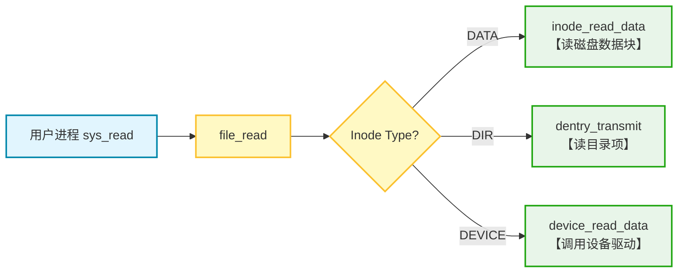

# LAB-9: 文件系统 之 文件管理与全系统整合

Lab-9 是整个操作系统内核构建的最终章。在本实验中，我将打通文件系统与进程管理、内存管理的“任督二脉”：

- 屏蔽底层 Inode 与设备的差异，实现“**一切皆文件**”的抽象。
- 同时，赋予内核加载并执行用户态 ELF 程序的能力，让我们的 OS 真正 **“活”起来**。

---

## 代码组织结构

```
OS2025-SEAOS 
├── LICENSE        开源协议
├── .vscode        配置了可视化调试环境
├── registers.xml  配置了可视化调试环境
├── .gdbinit.tmp-riscv xv6自带的调试配置
├── common.mk      Makefile中一些工具链的定义
├── Makefile       编译运行整个项目 (CHANGE)
├── picture        README使用的图片目录 (CHANGE)
├── README.md      实验报告 (CHANGE)
└── src            源码
    ├── kernel     内核源码
    │   ├── arch   RISC-V相关
    │   │   ├── method.h
    │   │   ├── mod.h
    │   │   └── type.h
    │   ├── boot   机器启动
    │   │   ├── entry.S
    │   │   └── start.c
    │   ├── lock   锁机制
    │   │   ├── spinlock.c
    │   │   ├── sleeplock.c
    │   │   ├── method.h
    │   │   ├── mod.h
    │   │   └── type.h
    │   ├── lib    常用库
    │   │   ├── cpu.c
    │   │   ├── console.c (NEW, 行缓冲的输入输出)
    │   │   ├── print.c (CHANGE, 在print_init中调用console_init进行初始化)
    │   │   ├── uart.c (CHANGE, 将uart_intr中的switch-case逻辑换成cons_edit)
    │   │   ├── utils.c
    │   │   ├── method.h (CHANGE)
    │   │   ├── mod.h
    │   │   └── type.h (CHANGE)
    │   ├── mem    内存模块
    │   │   ├── pmem.c (本实验补充, 增加函数pmem_stat用于获取剩余页面数量信息)
    │   │   ├── kvm.c
    │   │   ├── uvm.c (本实验补充, 修改uvm_heap_grow以支持flag的输入)
    │   │   ├── mmap.c
    │   │   ├── method.h (CHANGE)
    │   │   ├── mod.h
    │   │   └── type.h
    │   ├── trap   陷阱模块
    │   │   ├── plic.c
    │   │   ├── timer.c
    │   │   ├── trap_kernel.c
    │   │   ├── trap_user.c
    │   │   ├── trap.S
    │   │   ├── trampoline.S
    │   │   ├── method.h
    │   │   ├── mod.h
    │   │   └── type.h
    │   ├── proc   进程模块
    │   │   ├── proc.c (本实验补充, 增加open_file和cwd的初始化、设置、销毁逻辑)
    │   │   ├── exec.c (本实验完成, 操作ELF文件以填充新的进程)
    │   │   ├── swtch.S
    │   │   ├── method.h (CHANGE)
    │   │   ├── mod.h
    │   │   └── type.h (CHANGE)
    │   ├── syscall 系统调用模块
    │   │   ├── syscall.c (本实验补充, 新的系统调用)
    │   │   ├── sysfunc.c (本实验补充, 新的系统调用)
    │   │   ├── method.h (本实验补充, 新的系统调用)
    │   │   ├── mod.h
    │   │   └── type.h (本实验补充, 新的系统调用)
    │   ├── fs     文件系统模块
    │   │   ├── bitmap.c
    │   │   ├── buffer.c
    │   │   ├── inode.c
    │   │   ├── device.c (本实验完成, 增加设备文件操作逻辑)
    │   │   ├── dentry.c (本实验补充, 增加目录和路径的功能)
    │   │   ├── fs.c (本实验补充, 增加文件操作逻辑)
    │   │   ├── virtio.c
    │   │   ├── method.h (CHANGE)
    │   │   ├── mod.h
    │   │   └── type.h (CHANGE)
    │   └── main.c
    ├── mkfs       磁盘映像初始化
    │   ├── mkfs.c (CHANGE, 增加输入参数的支持)
    │   └── mkfs.h (CHANGE)
    ├── loader     存放链接脚本
    │   ├── kernel.ld (CHANGE, 移动了位置)
    │   └── user.ld (NEW, 定义了用户态ELF程序的链接规则)
    └── user       用户程序
        ├── initcode.c (CHANGE, 启动测试程序)
        ├── syscall.c (NEW, 封装了系统调用)
        ├── help.c (NEW, 其他公共库函数)
        ├── test_1.c (NEW, 测试点)
        ├── test_2.c (NEW, 测试点)
        ├── test_3.c (NEW, 测试点)
        ├── test_4.c (NEW, 测试点)
        ├── help.h (NEW, 库函数和重要定义)
        ├── sys.h
        ├── syscall_arch.h
        └── syscall_num.h (CHANGE, 新的系统调用)
```

相对于上一个实验, 本实验主要增加了以下功能：

- **实现了“一切皆文件”的抽象**：引入 `file_t` 结构体，屏蔽了底层 Inode 与字符设备的差异，为上层提供了统一的读写接口。
- **构建了设备驱动框架**：实现了 `stdin`, `stdout`, `null`, `zero` 等虚拟字符设备，并支持行缓冲的控制台 I/O。
- **实现了 ELF 程序加载器**：完成了 `exec` 逻辑，能够解析 ELF 文件头，加载代码段/数据段，并构建用户栈，使内核具备了运行用户程序的能力。
- **完善了进程与文件系统的交互**：在进程控制块中集成了 **当前工作目录 (CWD)** 和 **打开文件表**，支持 `fork` 时的文件描述符继承。
- **增强了目录与路径功能**：支持了基于当前工作目录 (CWD) 的 **相对路径解析**；实现了**文件/目录的创建**操作；实现了 **逆向路径解析**，支持从 Inode 回溯绝对路径；实现了 **硬链接 (Hard Link)** 机制，允许不同路径指向同一 Inode。
- **构建了用户态运行环境**：扩充了系统调用接口 (`syscall`)，新增了 `open`, `exec` 等核心调用，并提供了 `printf`, `open` 等基础用户态库函数，为用户程序的运行奠定了基础。

---

## 具体实现

### 0.准备工作

- 关于`src/loader`：`kernel.ld`和`user.ld`分别为内核和用户程序的**链接脚本**，决定二者的**入口地址、起始地址和内存布局**。我将二者比较后发现，内核的入口是`entry.S`，而用户程序的入口是`main`；内核起始地址为`0x80000000`（物理地址，高地址），而用户程序起始地址为`0x1000`（虚拟地址，低地址）

  > **后面的`proc_exec` 函数**在解析用户程序的 ELF 文件时，正是依据 `user.ld` 规定的起始虚拟地址（0x1000）来**建立页表映射、加载代码段与数据段，并最终将 PC 指针设置到该入口地址以启动用户程序**的

- pmem.c中的`pmem_stat`：用于统计当前系统中剩余的空闲物理页数量

- uvm.c中的`uvm_heap_grow`：将权限**flag**从默认的R| W 改为**可输入参数**

  ```c
  uint64 uvm_heap_grow(pgtbl_t pgtbl, uint64 cur_heap_top, uint32 len, int flag);
  ```

  > 这也是为**后面的 `proc_exec` 函数**做准备。加载 ELF 文件时，代码段需要 `R|X` 权限，而数据段需要 `R|W` 权限，灵活的flag控制是实现**段级保护**的前提。

- console.c以及uart.c和print.c的修改：为了支持console控制台交互，我引入了 **行缓冲 (Line Buffering)** 机制，并对uart.c和print.c进行了相应的小修改

  - uart.c中：在`uart_intr`中调用 `cons_edit(c)` 来处理字符输入，支持了退格等基本编辑功能
  - print.c中：在 `print_init` 中调用 `cons_init()`，完成了控制台缓冲区和锁的初始化

- 用户态测试架构的梳理 (`src/user`, `Makefile`, `mkfs`)：

  我深入分析了用户程序的构建与运行链条，明确了本次实验的测试逻辑：

  - **编译与镜像制作**：
    - Makefile 定义了**编译规则**。
    - mkfs.c负责**制作 `disk.img`**，创建超级块和 Inode 结构，并将编译好的用户程序（如 `test_1.elf`）**写入磁盘数据块**，使其持久化，供内核启动后读取。
  - **启动与运行**：
    - initcode.c作为 PID 1 的初始进程，它通过 `fork` + `exec` 的方式加载并运行具体的测试程序（如 `test_1`）。
    - **支持库**：syscall.c封装了汇编级的系统调用接口，help.c提供了 printf 等基础库函数，构成了用户程序的运行时环境（Runtime）。

  测试架构示意链条如下：

  ```c
  Makefile (编译构建) -> test_*.elf (生成可执行文件) -> mkfs.c (磁盘镜像制作工具) -> disk.img (持久化存储) -> initcode.c (启动进程 PID 1) -> fork + exec + wait (加载测试程序) -> test_1 (用户进程运行) -> syscall.c / help.c (运行时支持)
  ```

### 1. dentry.c：目录与路径功能补全

在 Lab-8 的基础上，我进一步完善了目录操作，重点实现了**相对路径解析**、**逆向路径解析**和**硬链接**。

#### 1.1 路径解析的增强 (`__path_to_inode`)

为了支持相对路径（如 `./file.txt`）和绝对路径（如 `/home/user/file.txt`）的统一解析，我在 `__path_to_inode` 中引入了**起始目录判断逻辑**：

- 若路径以 `/` 开头，从**根目录** `ROOT_INODE` 开始解析。
- 若路径不以 `/` 开头，从当前进程的 `cwd`（**当前工作目录**）开始解析。

#### 1.2 文件/目录的创建 (`path_create_inode`)

这是 `open(O_CREATE)` 和 `mkdir` 的核心后端。它不仅仅是创建一个 Inode，还负责维护目录树的一致性：

1.  **解析父目录**：首先调用 `path_to_parent_inode` 找到目标路径的父目录 Inode。
2.  **查重与创建**：在父目录中检查是否重名。若无重名，则分配新的 Inode。
3.  **关联目录项**：在父目录中创建新的 Dentry 指向新 Inode。
4.  **原子性保证**：如果中间任何一步失败（如磁盘满），会触发**回滚机制** —— 将新分配的 Inode 的 `nlink` 置 0，防止产生孤儿 Inode。

#### 1.3 逆向路径解析 (`inode_to_path`)

为了支持 `getcwd` （获取当前工作目录路径）等功能，我需要**从一个 Inode 回溯出它的绝对路径**。这依赖于我新增的底层函数 **`dentry_search_2`**。

- **反向查找 (`dentry_search_2`)**：
  不同于普通的 `dentry_search` 是通过文件名查找 Inode 号， `dentry_search_2` 则是**通过 Inode 号反查文件名**。
  - 它遍历目录的数据块，对比每个目录项的 `inode_num`，若匹配则将对应的 `name` 拷贝出来。

- **回溯流程 (`inode_to_path`)**：
  基于 `dentry_search_2`，我实现了自底向上的路径构建：
  1. 检查当前 Inode 是否为根目录。
  2. 若不是，在当前目录中查找 **`..`（父目录）** 的 `inode_num`。
  3. 进入父目录，调用 **`dentry_search_2`** 反查子 Inode 对应的**文件名**。
  4. 将文件名拼接到缓冲区前端，重复上述步骤，直到到达根目录。

#### 1.4 硬链接机制 (`path_link` / `path_unlink`)

硬链接机制是文件系统灵活性的体现，允许文件系统中的**多个目录项（Dentry）指向同一个物理 Inode**，从而实现文件的多路径访问。

- **创建硬链接 (`path_link`)**：
  该操作本质上是“**增加引用**”。
  1.  首先解析 `old_path` 获取目标 Inode，并**禁止对目录创建硬链接**，以防环路。
  2.  解析 `new_path` 的父目录，并在其中创建一个新的 Dentry，使其指向目标 Inode。
  3.  原子性地**增加目标 Inode 的 `nlink` 计数**并同步回磁盘。

- **解除硬链接 (`path_unlink`)**：
  该操作本质上是“**减少引用**”。
  1.  在父目录中查找并删除对应的 Dentry（将 `name` 清零）。
  2.  获取目标 Inode 锁，**递减其 `nlink` 计数**。
  3.  **资源回收**：当 `nlink` 降为 0 且内存引用 `ref` 也为 0 时（在 `inode_put` 中触发），系统会**自动回收**该 Inode 及其占用的所有数据块，实现文件的物理删除。

### 2. fs.c：文件的抽象

这是实现“一切皆文件”的关键。在深入实现之前，我需要先厘清 **File** 与 **Inode** 的核心区别：

- **Inode (全局共享)**：代表文件的**物理实体**。它是**静态**的，记录了文件的大小、磁盘块位置等信息，且需要**持久化存储**在磁盘上。
- **File (进程私有)**：代表进程对文件的**一次打开操作**。它是**动态**的，记录了当前的**读写偏移量 (offset)**、**访问权限 (readable/writable)** 等运行时状态，仅存在于内存中，**不持久化**。

#### 2.1 File 的生命周期管理

我引入了 `file_t` 结构体作为进程与底层资源之间的中间层，并实现了一系列管理函数：

- **初始化与分配 (`file_init` / `file_alloc`)**：
  - 初始化全局文件表锁 `lk_file_table`。
  - 分配时，线性扫描 `file_table` 寻找 `ref == 0` 的空闲槽位。

- **打开文件 (`file_open`)**：
  这是连接用户路径与内核资源的桥梁。
  1.  调用 `path_to_inode` 解析路径获取 Inode。
  2.  若文件不存在且指定了 `O_CREATE`，则调用 `path_create_inode` **创建新文件**。
  3.  若是设备文件，调用 `device_open_check` 进行权限检查。
  4.  分配 `file_t`，初始化权限位和 `offset = 0`，并绑定 Inode。

- **复制与关闭 (`file_dup` / `file_close`)**：
  - `file_dup`：仅**增加引用计数** `ref`（如 `fork` 时子进程继承父进程文件表）。
  - `file_close`：**递减引用计数**。当 `ref` 降为 0 时，释放 `file_t` 槽位，并调用 `inode_put` 释放底层的 Inode。

- **指针移动 (`file_lseek`)**：
  调整 `file->offset`，支持 **`SET` (绝对位置)**、**`ADD` (相对当前)**、**`SUB` (向前回退)** 三种模式。

#### 2.2 统一的读写分发逻辑 (`file_read` / `file_write`)

我在 `fs.c` 中实现了统一的 I/O 入口。根据底层 Inode 的类型，请求会被路由到不同的处理模块，具体流程如下：



- **普通文件 (DATA)**：调用 `inode_read_data` / `inode_write_data`，直接读写磁盘数据块，并自动更新 `offset`。
- **目录文件 (DIR)**：调用 `dentry_transmit`。该函数遍历目录的数据块，将有效的 `dentry_t` 结构体序列化并拷贝到用户缓冲区。
  - 这里需要注意：底层函数 `dentry_transmit` 是**无状态**的（每次调用默认从头开始），因此我在 `file_read` 中利用 `file->offset` 维护了**读取进度**。这确保了当用户分多次调用 `read` 时，系统能**跳过已读内容**，正确地遍历整个目录，而不是死循环读取第一个文件。
- **设备文件 (DEVICE)**：调用 `device_read_data` / `device_write_data`，转发给设备驱动程序（不经过磁盘 Buffer Cache）。

### 3. device.c：设备文件

设备文件不占用磁盘数据块，而是通过 **主设备号 (Major)** 映射到内核中的函数指针表。我构建了一个**通用的设备驱动框架**，使得内核可以**像操作文件一样操作硬件或虚拟设备**。

#### 3.1 基础设备实现

我在 `device.c` 中集成了多种基础字符设备：

- **标准输入 (`stdin`,  Major 1)**：映射到 `cons_read`，从控制台缓冲区读取输入。
- **标准输出 (`stdout`,  Major 2)**：映射到 `cons_write`，向控制台输出字符。
- **标准错误 (`stderr`,  Major 3)**：映射到 `cons_write`，但在输出内容前会自动添加 `"ERROR: "` 前缀，用于区分错误信息。
- **空设备 (`null`,  Major 4)**：写入操作直接丢弃（返回写入长度），读取操作立即返回 0 (EOF)。
- **零设备 (`zero`,  Major 5)**：读取时利用 `pmem_alloc` 分配全 0 页进行高效拷贝，提供无限的 0 数据流。
- **交互设备 (`gpt0`,  Major 6)**：一个简单的问答交互设备，演示了设备驱动处理复杂逻辑的能力。

#### 3.2 设备驱动框架的设计

为了管理上述设备，我设计了通用的驱动框架：

- **注册与初始化 (`device_init`)**：
  1.  清空全局设备表 `device_table`。
  2.  **注册**所有支持的设备回调函数。
  3.  **自动创建设备节点**：检查磁盘上的 `/dev` 目录及 `/dev/stdin` 等文件是否存在。若不存在，自动调用 `path_create_inode` 创建对应的**设备类型 Inode**，确保了文件系统的一致性。

- **权限检查 (`device_open_check`)**：
  在文件打开阶段，根据主设备号**检查操作的合法性**。例如，`stdin` 只允许读，`stdout` 只允许写。如果用户尝试以错误的模式（如写 stdin）打开设备，系统将**拒绝该请求**。

- **读写接口 (`device_read_data` / `device_write_data`)**：
  这是**设备操作的统一入口**。函数内部根据传入的 `major` 主设备号，在 `device_table` 中查找对应的函数指针（`read` 或 `write`），并进行调用转发。

### 4.proc.c：进程与文件系统

在完成了文件系统的底层构建后，需要将其与进程管理模块深度绑定，使进程拥有“**打开的文件表**“和“**当前工作目录**”的概念。

进程和文件交互的实现主要依赖`proc_t`新增的open_file和cwd这两个**核心字段**：

```c
/* 打开文件表：一个指针数组，index表示文件描述符fd,每个fd对应一个进程打开的文件file_t */
file_t *open_file[N_OPEN_FILE_PER_PROC] 
/* 当前工作目录：一个指向type为INODE_TYPE_DIR的inode的指针，记录进程当前处于文件系统树的哪个节点 */
inode_t *cwd
```

为了支持这两个字段的**生命周期**，我在 `proc.c`修改了以下关键函数：

- 初始化（**proc_init**）：利用`memset`将资源初始化为NULL

- 诞生（**proc_return**）： 对于第一个用户进程 `proczero`，**手动设置open_file**（打开stdin, stdout, stderr），确保了用户程序一运行就能使用 `printf` 或 `scanf` ；并**手动设置cwd**为根目录
- 继承（**proc_fork**）： 子进程通过 `fork` 诞生时，需要继承父进程的文件视图。分别调用`file_dup`和`inode_dup` 增加文件和cwd的**引用计数**，并将父进程**指针赋值**给子进程
- 回收（**proc_free**）： 进程退出时，遍历 `open_file`，对非空指针调用 `file_close`，以关闭文件表中的文件；调用 `inode_put` 以释放 `cwd`目录

其中需要注意的是**proc_return的设置**，在写的时候我考虑了几个问题：

- 首先是**为什么不在proc_make_first准备proczero的时候设置，而要在proczero第一次进入proc_return时进行手动设置**？

  其实这个和lab-7的时候`fs_init`初始化缓冲系统和读入superblock的时机密切相关，proczero第一次进入proc_return时是调用`fs_init`的“**最早安全时机**”，而利用`file_open`和`inode_get`手动打开文件/设置目录的**前提是文件系统已被初始化**，所以open_file和cwd的初始设置也一定要在proc_return函数中。（我最初听信ai在proc_make_first中进行设置就导致了错误...）

- 其次**proc_return函数内部的调用顺序**问题，由于`fs_init`初始化磁盘的过程中会调用sleeplock睡眠锁来等待磁盘I/O，不能在持有spinlock自旋锁的情况下调用，所以**一定要先释放自旋锁才能`fs_init`**；然后只有`fs_init`，初始化了文件系统后，才能`file_open`手动打开stdin, stdout, stderr；最后`trap_user_return`正式回到用户态。（我最初没有考虑顺序问题就导致了死锁...）

  ```c
  /* proc_return内部调用顺序 */
  spinlock_release(&p->lk);// 先释放锁
  fs_init();// 再初始化文件系统
  open_file[0] = file_open();// 然后手动打开stdin,stdout,stderr
  cwd = inode_get(ROOT_INODE);// 并将当前目录设置为根目录
  trap_user_return(); // 最后回到用户态
  ```

### 5.exec.c：执行ELF文件

接下来是本次实验实现的核心板块：`exec` ！它的功能是保留当前进程的 PID 和父子关系，但彻底替换其内存空间、代码和数据，使其变身为一个新的程序。（如果说 `fork` 是肉体的克隆，那么 `exec` 就是”灵魂的替换“...）

我对`proc_exec`函数的具体实现流程如下：

1. **准备新壳**： 分配新的物理页作为新Trapframe并初始化新页表，初始化新页表时建立了内核trampoline和trapframe的映射

   ```c
   trapframe_t *new_tf = (trapframe_t*)pmem_alloc(false); // 分配新的物理页作为新Trapframe
   pgtbl_t new_pgtbl = proc_pgtbl_init((uint64)new_tf); // 初始化新页表
   ```

2. **解析与读取ELF**： 调用 `path_to_inode`解析文件路径，找到 ELF 文件的inode；读取 ELF_header

   ```c
   inode_t *ip = path_to_inode(path); // 解析文件路径
   uint32 data_size = inode_read_data(ip, 0, sizeof(eh), &eh, false); // 读取 ELF_header
   ```

3. **加载segment至内存**： 依据 ELF 文件中Programe_header的描述字段，使用助教提供的辅助函数`prepare_heap`将类型为 `LOAD` 的段（代码段、数据段）加载到内存中；加载时利用了准备工作中对`uvm_heap_grow`的修改，使用flag参数支持不同段的权限控制（如代码段 `R|X`，数据段 `R|W`）

   ```c
   uint64 new_heap_top = prepare_heap(new_pgtbl, ip, &eh);
   ```

4. **释放文件资源**：代码已经读入内存了，不再需要持有文件的 Inode，使用`inode_put(ip)`释放ELF的inode

5. **构建栈**： 调用助教提供的辅助函数 `prepare_stack` 在新地址空间分配一页物理内存作为用户栈；并将参数压入用户栈（`argv`表示参数字符串数组，`argc`表示参数个数）

   ```c
   uint64 sp = prepare_stack(new_pgtbl, argv, &argc); 
   ```

6. **释放旧资源**： 已准备就绪，可以释放旧进程的页表和 Trapframe

7. **设置trapframe的相关字段**：`a0` 和 `a1` 分别为 `argc` 和 `argv`，作为main函数的传入参数；`user_to_kern_epc` 设为 `eh.entry` (ELF 入口地址)，决定了程序开始执行的 PC 指针；`sp` 为新的栈顶指针

   ```c
   new_tf->a0 = argc;        // 参数1: argc
   new_tf->a1 = sp;          // 参数2: argv
   new_tf->user_to_kern_epc = eh.entry;   // PC指针
   new_tf->sp = sp;          // SP指针
   ```

8. **更新进程的相关字段**：最后，将进程控制块 (`proc_t`) 指向新的资源（新pgtbl，新tf），重置堆栈信息，并将进程名修改为新程序的路径名。

`exec`的实现将内存、文件和进程三大系统整合在了一起：**内存管理系统**负责构建了一个新的虚拟地址空间（页表映射&堆栈构建）；**文件管理系统**负责从磁盘中找到并搬运可执行程序本身（路径解析&载入内存）；**进程管理系统**通过修改PCB和trapframe寄存器实现了程序的延续和流转。

### 6.sysfunc.c：系统调用

为了让用户程序能够使用文件系统和进程管理的功能，我在 `sysfunc.c` 中补充实现了以下系统调用：

```c
/* 文件操作类 */
sys_open()/sys_close() // 管理文件描述符的分配与回收。
sys_read()/sys_write() // 调用底层file_read/write读写文件
sys_dup() // 复制文件描述符，增加文件引用计数
sys_lseek() // 调整文件的读写指针位置，支持随机读写
sys_fstat() // 获取文件状态
    
/* 共享文件类 */
sys_link() // 创建硬链接，使多个文件名指向同一个 Inode
sys_unlink() // 解除硬链接，当引用计数为 0 时触发文件物理删除
    
/* 目录与路径类 */
sys_mkdir() // 创建新目录
sys_chdir() // 改变当前进程的工作目录 (cwd)
sys_get_dentries() // 读取目录项，用于 ls 等命令遍历目录内容
sys_print_cwd() // 打印当前工作目录的绝对路径（调试用）
    
/* 进程执行类 */
sys_exec() // 用新的 ELF 可执行文件替换当前进程的内存空间与执行流
```

---

## 测试与验证

在”0.准备工作“中已梳理了实现`proc_exec`后的**用户态测试架构**，修改 initcode.c 中的path和argv参数即可分别启动下列test：

### test1: 基础能力与参数传递

**测试代码**见 `src/user/test_1.c`。 本测试旨在验证用户进程最基础的**输入输出能力**以及 **`exec` 参数传递**的正确性。

**测试逻辑**：

1. **参数检查**：在 `main` 函数中打印 `argc` 和 `argv`，验证 `exec` 构建用户栈时是否正确传入了命令行参数。
2. **标准 I/O 测试**：
   - 利用 `fprintf(STDOUT, ...)` 输出提示信息。
   - 利用 `stdin` 从控制台读取用户输入。
   - 分别向 `STDOUT` 和 `STDERR` 回显输入内容。

测试结果见：[test-1.png](pictures/test-1.png)，正确打印出了参数列表；在输入字符串后，控制台也分别通过stdout和stderr正确回显了该字符串。通过测试！

### test2: 文件读写与元数据管理

**测试代码**见 `src/user/test_2.c`。 本测试涵盖了**普通文件**与**目录文件**的核心操作，验证文件系统的读写逻辑。

**测试逻辑**：

1. **根目录操作**：打开根目录 `/`，利用 `dup` 复制文件描述符，并调用 `fstat` 查看目录的元数据。
2. **文件读写与定位**：
   - 创建并打开 `/ABC.txt`。
   - 循环写入长字符串，制造较大的文件内容。
   - 调用 `fstat` 验证文件大小是否正确增加。
   - **随机读取**：使用 `lseek(..., LSEEK_SUB)` 将指针回退 50 字节，读取文件末尾的数据，验证 `lseek` 和 `read` 的配合。
3. **目录遍历**：利用 `sys_get_dentries` 读取根目录下的所有目录项，验证文件创建是否成功显示在目录中。

测试结果见：[test-2.png](pictures/test-2.png)，`fstat` 正确显示了文件类型和大小；`lseek`指针正确回退并读取到了末尾数据 "ABCDEFGHIJKLMNOPQRST" ；最后的目录遍历也成功看到了包括 `ABC.txt`的根目录下所以文件。通过测试！

### test3: 路径漫游与硬链接

**测试代码**见 `src/user/test_3.c`。 本测试重点验证 **路径解析系统**（特别是相对路径与 `cwd`）以及 **硬链接机制**。

**测试逻辑**：

1. **路径解析测试**：利用`sys_mkdir` 创建多级目录，使用 `chdir` 配合相对路径（如 `../../`）在目录树中穿梭。同时调用 `sys_print_cwd` 验证当前工作目录是否符合预期。
2. **硬链接测试**：
   - 在深层目录下创建 `hello.txt`。
   - 利用 `link` 在根目录下创建 `/link.txt` 指向同一文件。
   - 通过不同的相对路径打开这两个文件，验证写入 `link.txt` 后，原文件也能读到数据（**共享 Inode**）。
3. **删除与清理**：调用 `unlink` 依次删除链接文件和多级目录。

测试结果见：[test-3.png](pictures/test-3.png)，`print_cwd` 输出的路径正确；硬链接文件读写内容一致，`nlink=2`；删除操作后目录树也正确恢复原状。通过测试！

### test4：设备文件抽象

**测试代码**见 `src/user/test_4.c`。 本测试验证内核是否成功屏蔽了底层差异，将**字符设备**抽象为统一的文件接口。

**测试逻辑**：

1. **设备列表**：遍历 `/dev` 目录，检查是否包含 `null`, `zero`, `gpt0` 等预设设备。
2. **零设备 (`/dev/zero`)**：读取该设备，验证读出的缓冲区是否全为 0。
3. **空设备 (`/dev/null`)**：
   - 向其写入数据，应返回成功（写入字节数）但无实际效果。
   - 从其读取数据，应立即返回 0 (EOF)。
4. **交互设备 (`/dev/gpt0`)**：向该设备写入问题，检查是否能通过 `stdout` 收到预设的“笨蛋 GPT”的回答。

测试结果见：[test-4.png](pictures/test-4.png)，`/dev/zero` 读取全 0；`/dev/null` 读写行为符合黑洞特性；与 `gpt0` 的问答交互流畅。通过测试！

### test5：多进程文件共享

测试代码见 `src/user/test_5.c`。本补充测试旨在验证 `fork` 后**父子进程对文件资源的共享机制**，逻辑如下：

```
父进程打开文件 -> Fork -> 子进程写入 -> 子进程退出 -> 父进程检查 offset -> 父进程继续写入
```

测试结果见：[test-5.png](pictures/test-5.png)，可以看到父进程成功检测到了子进程写入后产生的**偏移量变化**（Current offset is 18），且在子进程退出后**仍能继续写入**，最终文件内容完整拼接了双方的数据。这验证了 `file_t` 结构体在 `fork` 时的**正确复制与引用计数管理**。通过补充测试！

---

## 总结与思考

- **“一切皆文件”的设计哲学** 

  通过引入 `file_t` 结构体和设备驱动框架，我成功屏蔽了底层物理资源（磁盘 inode、串口 buffer、虚拟设备）的差异。对于用户程序而言，无论是读写文件、向终端打印字符，还是操作零设备，都统一简化为了 `read/write` 系统调用。这种高度的抽象极大地降低了用户态编程的复杂度，是操作系统中非常智慧的设计哲学

- **exec：OS真正"活"了起来!**

  `proc_exec` 函数的实现过程，让我深刻理解了操作系统三大核心模块的协作关系：

  - **文件系统**提供了**静态**的蓝图（ELF 文件）；
  - **内存管理**提供了**动态**的容器（虚拟地址空间）；
  - **进程管理**赋予了**生命**的流转（Trapframe 上下文切换）。

   在此之前，文件只是磁盘上冰冷的字节，进程只是内存中重复的克隆（fork）；是 `exec` 打通了二者，让静态的程序变成了动态运行的进程，让我的 OS 真正“活”了起来！

---

## 尾声

终于在2026年的开头完成了小型操作系统内核9个lab的全部工作！！

从基础构建，到~~非常难的~~进程模块，再到最后的文件系统和整合，我一步步了解了操作系统如何一步一步启动，从hello world到全系统整合，从单进程到多进程，从内核到用户，如何处理中断，如何管理内存，如何分层抽象...终于建立了自己的小型OS内核~！

感谢助教的辛勤付出！（助教发布作业的仓库：[ECNU-OSLab-2025-Task: 从0到1的小型内核实现 ](https://gitee.com/xu-ke-123/ecnu-oslab-2025-task/tree/master/)）

感谢石老师的理论课为我的动手实践打下了坚固的基础！
