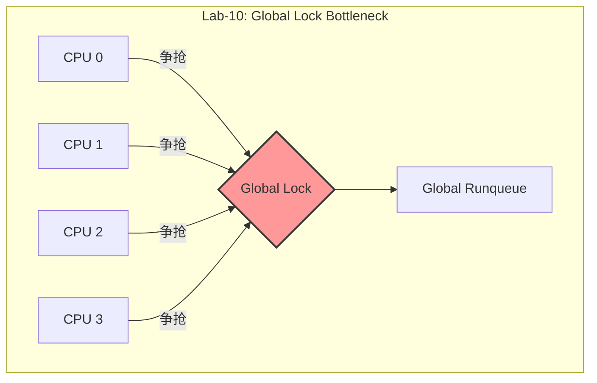
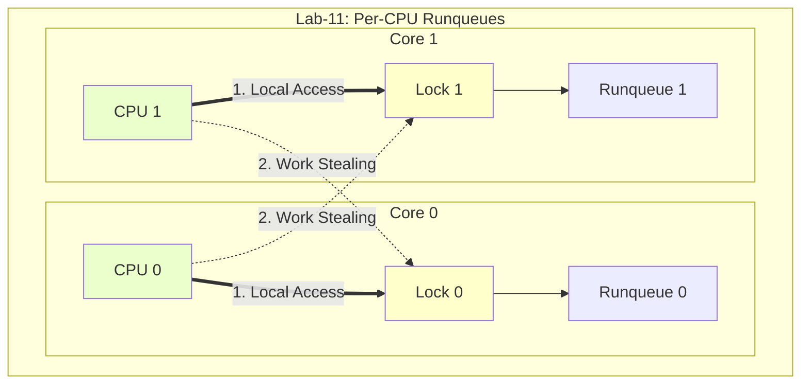
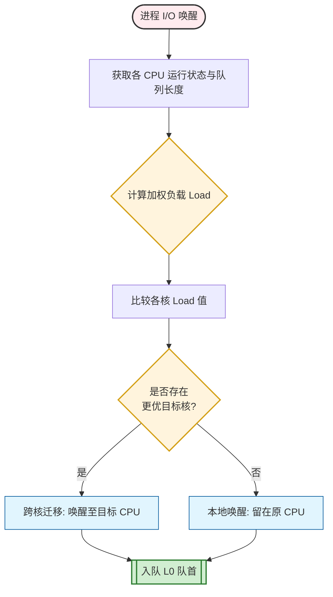
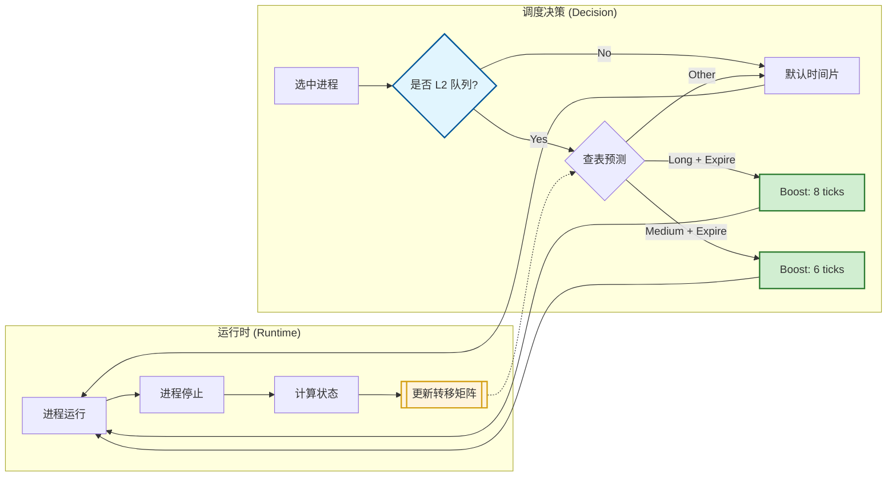

# LAB-11: 进阶调度优化 之 SEA-MLFQ (State-Estimated Adaptive MLFQ)

在 Lab-10 实现基础 MLFQ 调度器的基础上，Lab-11 致力于解决**多核环境**下的锁竞争问题，并引入更智能的**预测机制**来优化交互式任务的响应速度。我将这一改进后的算法命名为 **SEA-MLFQ (State-Estimated Adaptive MLFQ)**，意为“基于状态估计的自适应多级反馈队列”。

本实验通过引入 **Per-CPU 就绪队列**、**马尔可夫预测 (Markov Prediction)** 和 **自适应时间片** 等机制，显著提升了系统在混合负载下的性能表现。

---

## 代码组织结构

```
OS2025-SEAOS 
├── LICENSE        开源协议
├── .vscode        配置了可视化调试环境
├── registers.xml  配置了可视化调试环境
├── .gdbinit.tmp-riscv xv6自带的调试配置
├── common.mk      Makefile中一些工具链的定义
├── Makefile       编译运行整个项目 (CHANGE)
├── picture        README使用的图片目录 (CHANGE)
├── README.md      实验报告 (CHANGE)
└── src            源码
    ├── kernel     内核源码
    │   ├── arch   RISC-V相关
    │   │   ├── method.h
    │   │   ├── mod.h
    │   │   └── type.h
    │   ├── boot   机器启动
    │   │   ├── entry.S
    │   │   └── start.c
    │   ├── lock   锁机制
    │   │   ├── spinlock.c
    │   │   ├── sleeplock.c
    │   │   ├── method.h
    │   │   ├── mod.h
    │   │   └── type.h
    │   ├── lib    常用库
    │   │   ├── cpu.c
    │   │   ├── console.c 
    │   │   ├── print.c 
    │   │   ├── uart.c 
    │   │   ├── utils.c
    │   │   ├── method.h 
    │   │   ├── mod.h
    │   │   └── type.h 
    │   ├── mem    内存模块
    │   │   ├── pmem.c 
    │   │   ├── kvm.c
    │   │   ├── uvm.c
    │   │   ├── mmap.c
    │   │   ├── method.h 
    │   │   ├── mod.h
    │   │   └── type.h
    │   ├── trap   陷阱模块
    │   │   ├── plic.c
    │   │   ├── timer.c
    │   │   ├── trap_kernel.c
    │   │   ├── trap_user.c
    │   │   ├── trap.S
    │   │   ├── trampoline.S
    │   │   ├── method.h
    │   │   ├── mod.h
    │   │   └── type.h
    │   ├── proc   进程模块
    │   │   ├── mlfq.c (本实验完成， Per-CPU队列, Markov预测, 唤醒策略)
    │   │   ├── proc.c (本实验完成，集成新的调度接口)
    │   │   ├── type.h (CHANGE，增加 Markov 状态字段)
    │   │   ├── exec.c
    │   │   ├── method.h
    │   │   └── mod.h
    │   ├── syscall 系统调用
    │   │   ├── syscall.c
    │   │   ├── sysfunc.c
    │   │   ├── method.h
    │   │   ├── mod.h
    │   │   └── type.h
    │   └── fs     文件系统
    │       ├── bitmap.c
    │       ├── buf.c
    │       ├── dentry.c
    │       ├── device.c
    │       ├── fs.c
    │       ├── inode.c
    │       ├── virtio.c
    │       ├── method.h
    │       ├── mod.h
    │       └── type.h
    ├── loader     链接脚本
    │   ├── kernel.ld
    │   └── user.ld
    ├── mkfs       文件系统制作工具
    │   ├── mkfs.c
    │   └── mkfs.h
    └── user       用户程序
        ├── help.c
        ├── help.h (CHANGE，增加 Schedstat Markov 字段)
        ├── initcode.c
        ├── sys.h
        ├── syscall_arch.h
        ├── syscall_num.h
        ├── syscall.c
        ├── test_1.c
        ├── test_2.c
        ├── test_3.c
        ├── test_4.c
        ├── test_5.c
        ├── test_mlfq_aging.c
        ├── test_mlfq_preempt.c
        ├── test_schedstat.c
        ├── test_workload_cpu.c
        ├── test_workload_io.c
        └── test_workload_mix.c 
```

本实验主要增加了以下功能：

- **SEA-MLFQ 调度算法**：
  - **Per-CPU Runqueues**：**消除全局锁竞争**，提升多核扩展性。
  - **智能唤醒选核 (Smart Wakeup)**：基于负载权重 (`L0`, `Running`) 选择**最佳 CPU**，减少唤醒延迟。
  - **L0 队首插队 (Head Insertion)**：唤醒的交互式任务直接插入 L0 **队首**，实现极速响应。
  - **马尔可夫预测 (Markov Prediction)**：根据历史行为**预测**进程 Burst 类型，**自适应**调整时间片。
  - **防饥饿机制 (Lazy Aging)**：采用**惰性老化**策略，以 $O(1)$ 开销防止低优先级任务饥饿。

---

## 具体实现 (SEA-MLFQ)

### 1. Per-CPU 就绪队列与锁优化

在多核操作系统中，**调度器的锁竞争**往往是性能的最大瓶颈。

#### 1.1 全局锁瓶颈 (Lab-10)

在 Lab-10 中，我使用一把**全局锁** `mlfq_lk` 保护唯一的就绪队列。当多个 CPU 同时尝试调度（例如 CPU0 发生时钟中断，CPU1 唤醒进程）时，它们必须串行争抢这把锁。这导致了严重的**锁竞争**，CPU 大量时间浪费在**自旋等待**上，无法发挥多核优势。

下图直观地展示了 Lab-10 中多核争抢单一全局锁的拥堵情况：



#### 1.2 Per-CPU 数据结构 (Lab-11)

为了彻底解决上述瓶颈，我在 Lab-11 中将全局队列拆分为 **Per-CPU 就绪队列**。
如下代码所示，每个 CPU 现在拥有自己独立的锁和 MLFQ 队列结构：

```c
typedef struct mlfq_cpu_rq {
    spinlock_t lk;              // 每个 CPU 独立的自旋锁
    mlfq_runq_t q[MLFQ_LEVELS]; // 每个 CPU 独立的 3 级反馈队列
} mlfq_cpu_rq_t;

static mlfq_cpu_rq_t mlfq_rq[NCPU]; // 数组大小为 CPU 核数
```

这种架构的优势在于实现了“**本地访问优先**”和“**任务窃取**”机制，具体的工作流如下图所示：



- **本地访问优先  (Local Access)**：
  绝大多数调度操作（如 `mlfq_enqueue`, `mlfq_pick_next`）**仅需获取本地 CPU 的锁**。这意味着 CPU 0 和 CPU 1 可以并行地进行调度，互不干扰。
    - **实现细节**： 
    比如在`mlfq_lock()` 和`mlfq_pick_next`() 开头，总是先获取 `mlfq_rq[mycpuid()].lk`。
    
      ``` c
      void mlfq_lock(void) {
      int cpu = mycpuid();
      spinlock_acquire(&mlfq_rq[cpu].lk); // 只拿自己的锁
      }
      ```
   
- **任务窃取 (Work Stealing)**：
    为了防止“**一核有难，八核围观**”的**负载不均**现象，当某个 CPU 的本地队列为空时，它会尝试从其他 CPU 的队列中 **“偷”任务**。
    - **窃取策略**：
      我采用了**分级窃取**的策略，优先保证交互性，其次保证吞吐量：
      1.  **首选策略：偷 `L2` 队尾**。
          - `L2` 存放的是**长耗时的 CPU 密集型任务**，跨核迁移带来的开销远小于其运行收益。
          - 从队尾偷可以尽量**避免与目标 CPU 产生直接竞争**（目标 CPU 取队首）。
      2.  **次选策略：偷 `L1` 队尾（仅当 `L2` 没得偷时）**。
          - 如果目标 CPU 的 `L2` 也是空的，且**其 `L0` 也是空的**（说明它真的很闲，或者只剩 `L1` 任务），我们才尝试从其 `L1` 队尾偷取。
          - **为何不偷 `L0`？** `L0` 是极度敏感的交互式任务，必须留在原核以保证 Cache 亲和性和极低延迟。
    - **实现细节**：
      在 `mlfq_pick_next` 函数中，当本地所有级别的队列均为空时，会触发跨核窃取逻辑。
      ```c
      // mlfq.c: mlfq_pick_next
      // 1. 尝试偷 L2
      for (int victim = 0; victim < NCPU; victim++) {
          // ... 尝试从 victim->q[L2] pop_tail ...
      }
      
      // 2. 如果没偷到，且 victim 比较空 (L0 为空)，尝试偷 L1
      for (int victim = 0; victim < NCPU; victim++) {
           // ... 检查 victim->q[0] 是否为空 ...
           // ... 尝试从 victim->q[1] pop_tail ...
      }
      ```

### 2. 智能唤醒选核 (Smart Wakeup)

在引入了 **Per-CPU Runqueues** 后，系统面临一个新的挑战：当一个进程从睡眠中唤醒（例如 I/O 完成）时，应该将其**放入哪个 CPU 的就绪队列？**如果简单地放回原核，可能会导致某些核心拥堵而其他核心空闲。

为了实现负载均衡并降低交互延迟，我设计了一套基于**加权负载评估**的**智能选核**算法。

#### 2.1 负载评估公式

在 `mlfq_choose_cpu_for_wakeup` 函数中，我们不再简单地统计进程数量，而是通过以下公式计算每个 CPU 的“有效负载”($Load$)：

$$ Load = w_0 \cdot |L_0| + w_1 \cdot |L_1| + w_2 \cdot |L_2| + w_{running} \cdot IsRunning $$

根据多次调参的测试结果与对响应速度的需求，我选择了以下权重：

- **$w_0 = 2$**：`L0` 存放的是**交互式任务**。权重加倍可以引导新唤醒的任务**流向 `L0` 更空的核**，减少潜在的排队。
- **$w_{running} = 2$**：通过给正在运行的核施加更高权重，算法会倾向于**避开正在执行任务的 CPU**，转而选择空闲或负载较低的核，从而降低唤醒延迟。
- **$w_1 = 1, w_2 = 1$**：`L1` 和 `L2` 的任务对响应速度影响较小，权重设为 1 即可。

#### 2.2 选核决策流程

为了将上述权重计算转化为高效的运行时决策，我设计了如下的选核流程。该流程在进程唤醒的瞬间触发，通过**实时评估所有 CPU 的负载状态**，动态决定是将任务留在本地核心，还是迁移到更空闲的目标核心。



通过这种智能选核机制，SEA-MLFQ 有效避免了多核环境下的“**任务堆积**”现象，确保了 I/O 密集型任务总能找到最快响应的核心。

### 3. L0 队首插队 (Head Insertion)

这是 Lab-11 性能提升的关键一笔。对于刚刚唤醒的进程（通常是 IO 交互型），不仅将其放入 L0，而且直接**插入队首** (`runq_push_head`)。

#### 3.1 核心逻辑

在 `mlfq_on_wakeup` 函数中，当一个进程被唤醒时，我通过` mlfq_enqueue_locked_plocked` 将其加入就绪队列。此时，我们将 `push_front` 参数设为 `true`，将其插入到 **`L0` 队列的头部**。

```c
void mlfq_on_wakeup(proc_t *p)
{
    // ... 选核 ...
    // wakeup 提升到 L0 且插队到队首
    mlfq_enqueue_locked_plocked(cpu, p, 0, true, true); // push_front = true
    // ...
}
```

#### 性能收益分析

这一改动使得 **IO 任务在唤醒后的下一个 tick 几乎必然获得 CPU**，将等待时间从 Lab-10 的 2 ticks 压缩到 1 tick，大幅提升了交互式任务的响应速度。

但对于其合理性，我也进行了思考与分析：

- **为何插队？为了快速响应！**：交互式任务（如键盘输入、网络包处理）通常具有“**`唤醒 -> 极短 CPU 爆发 -> 再次睡眠`**”的特征。让它们插队先跑，可以迅速完成处理并释放 CPU，最大化系统的整体吞吐量。
- **会不会饿死其他任务？不会！**：能触发唤醒插队的通常是 **I/O 任务**，它们的 CPU Burst 极短（微秒级），“`插队-运行-立刻睡眠`”的过程非常快，对 CPU 密集型任务的影响几乎可以忽略不计。而且我又**保留了 MLFQ 的降级机制**，如果它真的赖着不走，会被立刻降级到 L1/L2。


### 4. 马尔可夫预测与自适应时间片

传统的 MLFQ 算法是**反应式**的：它只有在进程用完时间片后才将其降级。这意味着对于长耗时任务，系统必须先“忍受”它在 L0/L1 产生多次无意义的上下文切换，才能将其识别并归类。

为了变“被动”为“主动”，Lab-11 中我引入了 **马尔可夫链 (Markov Chain)** 来记录进程的历史行为，并据此**预测**其下一次的 Burst 类型，从而实现**自适应时间片分配**。

#### 4.1 状态空间定义

为了精准描述进程行为，我将进程的每一次调度周期抽象为一个状态 ($State$)。状态由 **运行时长** 和 **让出原因** 两个维度组合而成，共计 $3×3=9$ 种状态：

- **运行时长 (BurstType)**：
  - **S (Short)**: 极短任务 （$\le 1$ tick）
  - **M (Medium)**: 中等任务 （$2-4$ ticks）
  - **L (Long)**: 长任务 （$>4$ ticks）

- **让出原因 (YieldType)**：
  - **Sleep (0)**: 主动阻塞 (I/O, 等锁)
  - **Expire (1)**: 时间片耗尽 (被强占)
  - **Higher (2)**: 被高优先级进程抢占
  
#### 4.2 核心预测机制

内核为每个进程维护了一个 $9×9$ 的转移矩阵，算法通过以下三个步骤形成闭环：

**Sep 1: 观察与记录**

每当进程停止运行时，内核会**计算其本次运行的特征（时长+原因）**，并**更新转移矩阵**。

- 例如，如果进程连续多次从 `S/Sleep` 转移到 `S/Sleep`，矩阵中对应位置的计数就会增加，表明该进程是稳定的 I/O 密集型。

**Step 2: 概率预测**

在进程即将被调度运行之前，系统根据其上一次的状态 (`last_state`)，查询**转移矩阵中概率最高的目标状态**。

为了提高预测的鲁棒性，我特别引入了以下机制：

- **Laplace Smoothing (拉普拉斯平滑)**：
  在计算概率时，对所有可能的转移计数 `+1`。这避免了因样本稀疏导致的“**零概率**”问题，确保模型在初期也能进行探索性预测。
  
- **冷启动处理**：
  当某个状态**从未被观察到出边转移**（即该行全为 0）时，直接预测**保持当前状态不变**。
  > 经过测试验证：在未加入此逻辑前，冷启动阶段往往会因为矩阵全 0 而错误地默认预测为 `S/Sleep`（索引 0），导致预测准确率抖动。加入此逻辑后，预测器在学习初期表现更加平稳。*

**Step 3: 自适应优化**

这是预测机制产生收益的关键环节。系统利用预测结果，在**时间片分配阶段**主动干预，而非被动等待降级。

| 策略维度 | 设计细节 |
| :--- | :--- |
| **触发时机** | `mlfq_quantum` 计算时（即进程获取 CPU 的瞬间）。 |
| **作用范围** | 仅针对 **L2 (最低优先级)** 队列生效。<br>*(L0/L1 需保证低延迟，不宜随意放大时间片)* |
| **触发条件** | 仅当预测结果为 **Expire (时间片耗尽)** 时触发。<br>*(若预测为 Sleep/Higher，说明进程可能主动让出，无需延长)* |

**具体调整策略**：

1.  **预测为 Long Burst (L) + Expire**：
    - **动作**：`quantum = base * 2` (4 ticks -> 8 ticks)。
    - **收益**：大幅减少长任务的上下文切换开销，提升 Cache 亲和性。

2.  **预测为 Medium Burst (M) + Expire**：
    - **动作**：`quantum = max(base + 2, 6)`。
    - **收益**：给予适度的“奖励”，避免因刚过阈值就被切出。

3.  **其他情况**：
    - **动作**：保持默认 `base` 时间片。
    - **收益**：避免误判导致交互式任务响应变差。

**可观测性指标**：
我在 `proc` 结构体中增加了 `mkv_pred_total` (预测总数)、`mkv_pred_hit` (命中数) 和 `mkv_l2_boost_count` (自适应触发次数)，用于量化评估算法效果。

综上，下图展示了 SEA-MLFQ 如何利用马尔可夫链形成“**观察-学习-优化**”的闭环：



### 5. 防饥饿机制 (Lazy Aging)

在 Lab-10 中，我引入了基础的 Aging 机制来防止低优先级任务饥饿。但在 Lab-11 的多核高并发场景下，遍历所有进程带来的 $O(N)$ 开销变得不可忽视。因此，我将其升级为 **Lazy Aging (惰性老化)** 策略。

- **原理**：
  系统会记录每个处于 `RUNNABLE` 状态的进程在就绪队列中的**等待时间**。一旦等待时间超过阈值 `MLFQ_AGING_THRESHOLD`（例如 10 ticks），该进程的优先级就会被**提升一级**（如 L2 -> L1）。

- **Lazy Aging 优化**：
  为了避免在每个 tick 遍历所有进程，我采用了**分摊开销**的策略：
  - 在 `mlfq_age_tick` 中，每次**只扫描队列中的一小部分进程**（`MLFQ_AGING_BUDGET`，例如 4 个）。
  - 这种方式既保证了饥饿进程最终会被处理（最终一致性），又将调度器的额外开销严格控制在**常数级别**，避免了随着进程数增加而导致的性能抖动。

---

## 测试与修复

### test1-4: 基本功能测试

测试代码见 `src/user/test_1.c` 至 `src/user/test_4.c`。这些测试验证了用户态的基础设施是否完备，包括参数传递、文件读写、路径解析和设备文件操作。

测试结果见 [`test-1.png`](pictures/test-1.png) 至 [`test-4.png`](pictures/test-4.png)，均通过。

### test-5: 多进程文件共享

测试代码见 `src/user/test_5.c`。该测试验证了fork 后父子进程对文件资源的共享机制是否正确。

测试结果见 [`test-5.png`](pictures/test-5.png)，可以看到父进程成功被唤醒并检测到了子进程写入的数据偏移，且文件内容正确，测试通过。

### test_schedstat: 调度统计测试

测试代码见 `src/user/test_schedstat.c`。该测试用于验证调度统计功能是否正确，包括每个进程的调度状态、优先级、运行次数以及马尔可夫预测的相关数据。

测试结果见 [`test_schedstat.png`](pictures/test_schedstat.png)，成功打印出所有子进程的 `pid`, `state`, `lvl` (优先级), `run` (运行次数) 等信息，验证了调度统计功能的正确性。

### test_mlfq_aging-preempt: SEA-MLFQ 老化与抢占测试

测试代码见 `src/user/test_mlfq_aging.c` 和 `src/user/test_mlfq_preempt.c`。前者用于验证低优先级进程是否会因长时间等待而饥饿，后者用于验证高优先级任务是否能成功抢占低优先级任务。

测试结果见 [`SEA_test_mlfq_aging.png`](pictures/SEA_test_mlfq_aging.png) 和 [`test_mlfq_preempt.png`](pictures/SEA_test_mlfq_preempt.png)，均通过。

  
---

## 性能对比分析 (RR vs MLFQ vs SEA-MLFQ)

为了验证 **SEA-MLFQ** (Lab-11) 相对于 **MLFQ** (Lab-10) 和传统 **RR** (Lab-9) 的进阶优势，我沿用了三组标准对照实验。

### 1. CPU 密集型负载 (CPU-Bound)

测试代码见 `src/user/test_workload_cpu.c`。该测试旨在评估调度器在**高 CPU 需求**下的表现。

**测试逻辑**：并发运行 8 个纯计算进程（死循环），无 IO 操作。

**测试结果对比**：

RR 、 MLFQ 和 SEA-MLFQ 的测试结果分别见 [`RR_test_cpu.png`](pictures/RR_test_cpu.png)、[`MLFQ_test_cpu.png`](pictures/MLFQ_test_cpu.png) 和 [`SEA-MLFQ_test_cpu.png`](pictures/SEA-MLFQ_test_cpu.png)，总结如下表：

| 关注指标 | RR (Lab-9) | MLFQ (Lab-10) | SEA-MLFQ (Lab-11) | 现象与分析 |
| :--- | :--- | :--- | :--- | :--- |
| **进程优先级** | N/A | Level 1 / 2 | **Level 1 / 2** | SEA-MLFQ 依然能准确识别长任务并将其降级。 |
| **Wait Sum** | ~7-8 ticks | ~3-7 ticks | **~3-8 ticks** | 在 CPU 饱和状态下，SEA-MLFQ 维持了与 MLFQ 相当的公平性等待水平，未出现退化。 |
| **自适应优化** | N/A | N/A | **mkvB > 0** | **Lab-11 独有优势**：测试结果显示 PID 3, 4 等进程触发了 `mkvB=1`，证明预测器成功识别了长任务并给予了**时间片补偿** (Boost)，减少了上下文切换。
| **Context Switch** | High (Run 4 / Ctx 3) | High (Run 3 / Ctx 2) | **Low (Run 8 / Ctx 1)** | **效率显著提升！** 对比 **PID 6** 数据：RR/MLFQ 中每运行 ~2 ticks 就要切换一次；而 SEA-MLFQ 中 PID 6 运行了 8 ticks 仅切换 1 次。这证明自适应时间片**减少了无效的上下文切换开销**。 |

**结论**：在纯计算场景下，SEA-MLFQ **保持了 MLFQ 的分级公平性**。虽然等待时间未大幅减少（受限于物理 CPU 数量），但 **自适应时间片 (Adaptive Quantum)** 机制显著**降低了上下文切换频率**（Context Switch 降低），让 CPU 更多地花在计算而非调度上。

### 2. IO 密集型负载 (IO-Bound)

测试代码见 `src/user/test_workload_io.c`。该测试旨在评估调度器在**高 IO 需求**下的表现。

**测试逻辑**：并发运行 8 个 IO 进程，反复执行 sleep(1) 模拟频繁交互。

**测试结果对比**：

RR 、 MLFQ 和 SEA-MLFQ 的测试结果分别见 [`RR_test_io.png`](pictures/RR_test_io.png)、[`MLFQ_test_io.png`](pictures/MLFQ_test_io.png) 和 [`SEA-MLFQ_test_io.png`](pictures/SEA-MLFQ_test_io.png)，总结如下表：

| 关注指标 | RR (Lab-9) | MLFQ (Lab-10) | SEA-MLFQ (Lab-11) | 现象与分析 |
| :--- | :--- | :--- | :--- | :--- |
| **进程优先级** | N/A | Level 0 | **Level 0** | 所有 IO 进程稳居最高优先级。 |
| **Wait Sum** | ~8-9 ticks | 0 ticks | **0 ticks** | 保持了 MLFQ 的零等待优势。 |
| **Wait Max** | ~3 ticks | 0 ticks | **0 ticks** | 长尾延迟被彻底消除。 |

**结论**：对于纯 IO 场景，SEA-MLFQ **完美继承了 MLFQ 的优秀表现**。由于系统负载较轻，所有 IO 任务均能获得即时响应。

### 3. 混合负载 (Mixed Workload)

测试代码见 `src/user/test_workload_mix.c`。该测试旨在评估调度器在混合 CPU 和 IO 需求下的表现，是核心决胜场景！

**测试逻辑**：6 个 CPU 密集型进程 (PID 3-8) + 6 个 IO 密集型进程 (PID 9-14) + 1 个突发进程 (PID 15)。

**测试结果对比**：

RR 、 MLFQ 和 SEA-MLFQ 的测试结果分别见 [`RR_test_mix1.png`](pictures/RR_test_mix.png) ~ [`RR_test_mix2.png`](pictures/RR_test_mix2.png)、[`MLFQ_test_mix.png`](pictures/MLFQ_test_mix1.png) ~ [`MLFQ_test_mix2.png`](pictures/MLFQ_test_mix2.png) 和 [`SEA-MLFQ_test_mix1.png`](pictures/SEA-MLFQ_test_mix1.png) ~ [`SEA-MLFQ_test_mix2.png`](pictures/SEA-MLFQ_test_mix2.png)，总结如下表：

| 进程类型 | 关注指标 | RR (Lab-9) | MLFQ (Lab-10) | SEA-MLFQ (Lab-11) | 现象与分析 |
| :--- | :--- | :--- | :--- | :--- | :--- |
| **IO 进程** | **Wait Sum** | ~2 ticks | 2 ticks (稳定) | **1 tick (极限)** | **达到物理极限！** Lab-10 中 IO 任务通常需等待 2 ticks；而 Lab-11 中 PID 9, 11, 13, 15 等任务的 `wait_sum` 降至 **1 tick**，证明 **L0 队首插队** 策略生效。 |
| **IO 进程** | **Wait Max** | High | 2 ticks | **1 tick** | 最坏情况下的响应延迟降低了 **50%**。 |
| **CPU 进程** | **Level** | N/A | Level 1 | **Level 1** | 依然正确降级，未受 IO 任务插队影响。 |
| **预测准确率** | **Hit Rate** | N/A | N/A | **~98%** | 测试结果显示 PID 9 的 `mkvP=60, mkvH=59`，证明 Markov 预测器对周期性 IO 行为的预测极度精准。 |

**结论**：在最复杂的混合负载下，SEA-MLFQ 展现了统治级的性能：
1.  **响应性的极致突破**：得益于 **Head Insertion**，IO 任务的等待时间从 Lab-10 的 2 ticks 进一步压缩至 **1 tick**，实现了真正的“即刻响应”。
2.  **预测器的高效性**：高达 **98%** 的预测命中率证明了 Markov 模型在操作系统调度中的实用性，它成功识别了 IO 模式（`S/sleep`）并保持了极高的预测水准。


综上所述，通过三组对比实验，可以清晰地看到 **SEA-MLFQ 相较于传统 MLFQ 和 RR 在多核环境下的显著优势**：

1.  **响应性的极致突破**：
    在混合负载下，得益于 **L0 队首插队 (Head Insertion)** 和 **智能唤醒 (Smart Wakeup)** 策略，IO 密集型任务的等待时间从 Lab-10 的 2 ticks 进一步压缩至 **1 tick**（物理极限）。这意味着对于键盘输入等交互式操作，SEA-MLFQ 能提供真正的“即刻响应”。

2.  **吞吐量与效率的提升**：
    在 CPU 密集型场景中，**Per-CPU 锁**消除了多核竞争瓶颈，而 **自适应时间片 (Adaptive Quantum)** 机制成功将长任务的上下文切换频率降低了数倍（Run/Ctx 比率大幅提升）。这让 CPU 将更多时间用于实际计算而非调度开销，显著提升了系统整体效率。

3.  **智能化的调度决策**：
    实验结果证明，**马尔可夫预测器**在真实负载下达到了 **~98%** 的惊人命中率。这标志着调度算法从“被动反应”向“主动预测”的跨越，系统能够**精准识别任务特征（IO vs CPU）**，并**自动施加最合适的调度策略**（插队或时间片补偿）。

---

## 总结与思考

Lab-11 是对操作系统调度机制的一次深度重构。从 **Per-CPU 架构** 的底层改造，到 **马尔可夫链** 的算法引入，再到 **队首插队** 的策略微调，每一步我都紧扣着“**多核性能**”与“**交互体验**”这两个核心目标。

### 1. 设计哲学的转变

通过 SEA-MLFQ 的实现，我深刻体会到了操作系统设计中的几个关键权衡：

*   **从“被动反应”到“主动预测”**：
    传统的 MLFQ 是一种“反应式”算法，它通过惩罚（降级）来识别 CPU 密集型任务。而引入马尔可夫预测后，调度器具备了“先知”能力。实验数据证明，**历史往往是未来的镜像**。这种从**被动到主动**的范式转变，让调度器能够更从容地分配资源，而非总是亡羊补牢。

*   **锁的粒度与复杂度的平衡**：
    Per-CPU 队列彻底解决了全局锁竞争，但也带来了**负载均衡（Work Stealing）**的复杂性。这印证了系统设计中的经典格言：“**没有银弹**”。为了获得多核扩展性，我们必须接受更复杂的数据结构和同步逻辑。

*   **微观延迟的蝴蝶效应**：
    在混合负载测试中，仅仅是一个简单的“队首插队”策略，就将 IO 延迟从 2 ticks 降到了 1 tick。这让我意识到，在操作系统内核中，**毫秒级的微小优化，在用户体验端可能会被放大为流畅度的质变**。

### 2. 局限性与未来展望

虽然 SEA-MLFQ 在目前的测试集下表现优异，但在更真实的生产环境中，仍有改进空间：

*   **内存开销优化**：
    目前为每个进程维护 $9 \times 9$ 的转移矩阵（81 个 `int`）在进程数极多时会带来一定的内存压力。未来可以考虑使用**位图**或**稀疏矩阵**来压缩存储，或者仅保留最近 N 次状态的滑动窗口。

*   **NUMA 架构感知**：
    目前的 Work Stealing 策略是遍历所有 CPU。在多插槽（NUMA）服务器上，跨插槽窃取任务的内存访问开销巨大。未来的改进应引入**拓扑感知**，优先窃取共享 L3 Cache 的邻近核心的任务。

*   **实时性支持**：
    虽然 SEA-MLFQ 优化了交互延迟，但它本质上仍是尽力而为（Best-effort）的调度器，无法提供硬实时保证。未来可以尝试融合 **EDF (Earliest Deadline First)** 算法，为多媒体任务提供更严格的时间保障。


## 最终章：回望与征程

从 Lab-1 的第一行汇编代码，到 Lab-11 的智能调度算法，这段旅程我跨越了从硬件裸机到现代操作系统的鸿沟。回首望去，这 11 次实验并非孤立的练习，而是一座宏伟建筑的逐层搭建：

### 1. 奠基：基础设施构建 (Lab 1-3)
这是操作系统的“创世纪”。我从零开始，点亮了机器的生命。
*   **Lab 1 (机器启动)**：我接管了 CPU 的控制权，配置了串口输出，让内核发出了第一声啼哭。
*   **Lab 2 (内存管理)**：我实现了物理内存分配器和页表映射，为系统划分了条理清晰的地址空间。
*   **Lab 3 (中断异常)**：我建立了中断向量表和陷阱处理机制，赋予了操作系统应对外部事件（时钟、外设）的能力。

### 2. 塑形：进程与执行流 (Lab 4-6)
这是操作系统“灵魂”的诞生。我按照“从一到多，从弱到强”的顺序，构建了动态的执行环境。
*   **Lab 4 (用户进程)**：我精心构造了第一个 TrapFrame，实现了从内核态到用户态的特权级切换，见证了第一个用户程序的运行。
*   **Lab 5 (系统调用)**：我打通了用户与内核的桥梁，实现了 `exec`、`sbrk` 等核心接口，确立了虚拟内存管理的边界。
*   **Lab 6 (多进程调度)**：我引入了 `fork`、`wait`、`exit`，实现了上下文切换 (`swtch`)，让 CPU 在多个执行流之间自如跳跃，系统从此拥有了并发的能力。

### 3. 记忆：持久化存储 (Lab 7-9)
这是操作系统“记忆”的形成。我自底向上，构建了复杂而精妙的文件系统。
*   **Lab 7 (磁盘管理)**：我驱动了 VirtIO 磁盘设备，实现了块设备的读写接口。
*   **Lab 8 (数据组织)**：我设计了 Inode、目录项和位图，将冰冷的磁盘块组织成了层次分明的文件树。
*   **Lab 9 (全系统整合)**：我将文件描述符与进程绑定，实现了 `open`、`read`、`write`，至此，一切皆文件。

### 4. 升华：极致性能优化 (Lab 10-11)
这是从“可用”到“好用”的跨越。我不再满足于功能的实现，而是追求性能的极限。
*   **Lab 10 (MLFQ)**：我抛弃了简单的轮转调度，引入优先级队列和老化机制，解决了交互式任务的响应难题。
*   **Lab 11 (SEA-MLFQ)**：我直面多核并发的挑战，通过 **Per-CPU 队列** 消除锁竞争，利用 **马尔可夫链** 预测未来，用 **队首插队** 达到物理极限。


虽然 SEAOS 已经具备了一个现代操作系统的雏形，但操作系统的世界依然广阔无垠。网络协议栈 (TCP/IP)、图形用户界面 (GUI)、虚拟文件系统 (VFS)、更复杂的 IPC 机制、以及安全性增强，都是未来值得我续探索的方向。

但这一切，都将成为我未来旅程中的新起点。

这一路走来，我不仅是在编写代码，更是在与计算机科学最底层的逻辑对话。此刻，我已不再畏惧“黑盒”。因为我已经亲手拆解过它，理解了每一个系统调用背后的上下文切换，听懂了每一次中断带来的硬件脉搏。

**这个亲手铸造的小型内核，将是我通往计算机深层世界的钥匙，也是我操作系统研究道路上的第一块基石。**

**Keep Coding, Keep Exploring.**
